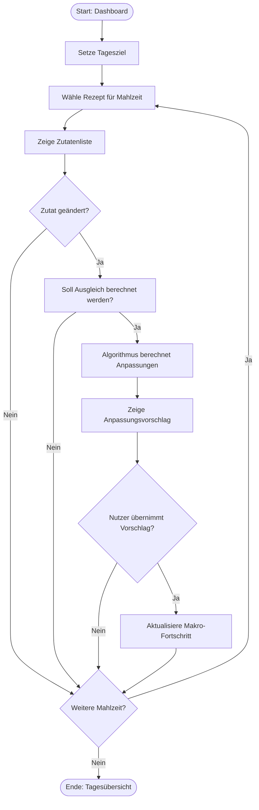
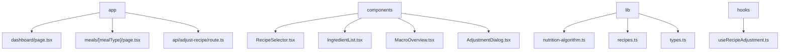

# 🍉 Food Tracker 
Next.js project to visualise a concept of an adaptive nutrition & calorie tracker app.

## ⏩ User Journey

```mermaid
flowchart TD
  Start([Start: Dashboard])
  SetGoal[Setze Tagesziel]
  SelectRecipe[Wähle Rezept für Mahlzeit]
  ShowIngredients[Zeige Zutatenliste]
  ChangeIngredient{Zutat geändert?}
  AskAdjust[Soll Ausgleich berechnet werden?]
  RunAlgo[Algorithmus berechnet Anpassungen]
  ShowDialog[Zeige Anpassungsvorschlag]
  AcceptChange{Nutzer übernimmt Vorschlag?}
  UpdateMacros[Aktualisiere Makro-Fortschritt]
  NextMeal{Weitere Mahlzeit?}
  End([Ende: Tagesübersicht])

  Start --> SetGoal
  SetGoal --> SelectRecipe
  SelectRecipe --> ShowIngredients
  ShowIngredients --> ChangeIngredient
  ChangeIngredient -- Nein --> NextMeal
  ChangeIngredient -- Ja --> AskAdjust
  AskAdjust -- Nein --> NextMeal
  AskAdjust -- Ja --> RunAlgo
  RunAlgo --> ShowDialog
  ShowDialog --> AcceptChange
  AcceptChange -- Ja --> UpdateMacros
  AcceptChange -- Nein --> NextMeal
  UpdateMacros --> NextMeal
  NextMeal -- Ja --> SelectRecipe
  NextMeal -- Nein --> End
```

## 🏗 Implementation & Project Structure
### Project Structure

```mermaid
graph TD
  A[app]
  A1[dashboard/page.tsx]
  A2["meals/[mealType]/page.tsx"]
  A3[api/adjust-recipe/route.ts]
  B[components]
  B1[RecipeSelector.tsx]
  B2[IngredientList.tsx]
  B3[MacroOverview.tsx]
  B4[AdjustmentDialog.tsx]
  C[lib]
  C1[nutrition-algorithm.ts]
  C2[recipes.ts]
  C3[types.ts]
  D[hooks]
  D1[useRecipeAdjustment.ts]
  A --> A1
  A --> A2
  A --> A3
  B --> B1
  B --> B2
  B --> B3
  B --> B4
  C --> C1
  C --> C2
  C --> C3
  D --> D1
```
